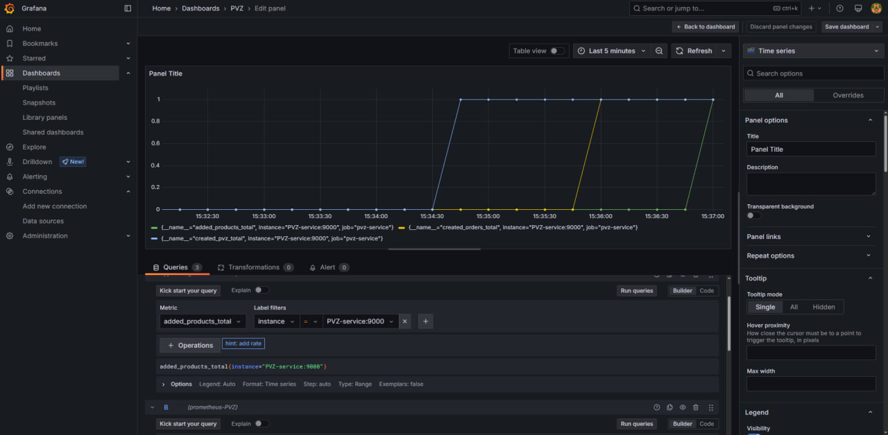
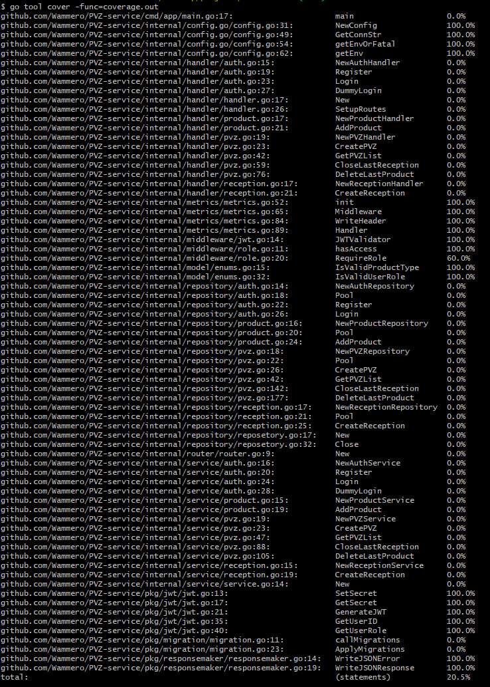

# PVZ-service
PVZ-service

## Установка и запуск

1. Клонировать репозиторий:
```bash
git clone https://github.com/Wammero/PVZ-service.git
cd PVZ-service
```
2. Запустить сервисы:
```bash
docker-compose build
dokcer-compose up
```  

3. Сервис доступен по адресу:
```
API: http://localhost:8080
```

## Тестированиие

```bash
docker-compose -f docker-compose.test.yml up
go test -coverprofile=coverage.out ./...
go tool cover -func=coverage.out
docker-compose -f docker-compose.test.yml down -v
```

## Линтер

В проекте используется golangci-lint для статического анализа кода. Конфигурация линтера находится в файле `.golangci.yml`.

Для запуска линтера выполните: golangci-lint run

## Недостатки текущей реализации

1. Большая часть кодовой базы не покрыта unit-тестами:
   - Отсутствуют тесты для большинства бизнес-логики
   - Не протестированы многие обработчики HTTP-запросов
   - Нет тестов для работы с базой данных
   - Отсутствует тестирование граничных случаев

Требуется дополнительная работа по увеличению тестового покрытия для обеспечения надежности системы.

## Преимущества текущей реализации

1. Архитектурные решения:
   - Использование интерфейсов для ограничения доступа между слоями приложения
   - Четкое разделение ответственности между компонентами
   - Легкость замены реализаций благодаря интерфейсам

2. Производительность:
   - Поддержка высокого RPS за счет эффективной обработки запросов
   - Использование агрегированных запросов к базе данных для минимизации количества обращений
   - Оптимизация нагрузки на БД за счет получения всех необходимых данных одним запросом


3. Мониторинг:
   - Prometheus доступен по адресу: http://localhost:9090
   - Grafana доступна по адресу: http://localhost:3000

4. Интеграционное тестирование:
   - Реализован последовательный end-to-end тест, охватывающий полный цикл работы с приёмкой:
     - Авторизация пользователей
     - Создание ПВЗ
     - Создание приёмки
     - Добавление 50 товаров
     - Закрытие приёмки
   - Тест легко масштабируется под большее количество товаров путем изменения константы в цикле
   - Использует переиспользуемые вспомогательные функции для HTTP-запросов

## Скриншот дашборда Grafana



## Скриншот тестового покрытия



Как видно из скриншота, текущее тестовое покрытие включает:

- Тестирование middleware (JWT валидация, проверка ролей)
- Тесты для responsemaker (формирование JSON ответов)
- Тесты для config (загрузка и валидация конфигурации)
- Тесты для metrics (сбор и экспорт метрик Prometheus)
- Unit-тесты для некоторых вспомогательных пакетов


## Важное замечание по Makefile

⚠️ В настоящий момент не рекомендуется использовать команды из Makefile, так как они не были полностью протестированы из-за проблем с WSL. Работа над стабилизацией make-команд продолжается.

До устранения проблем рекомендуется запускать docker-команды напрямую через docker-compose.

